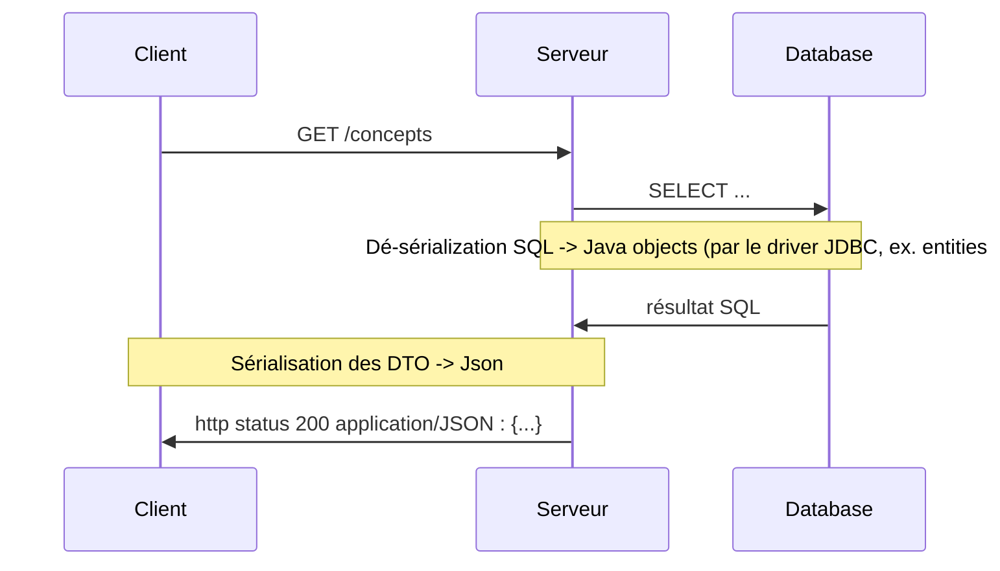
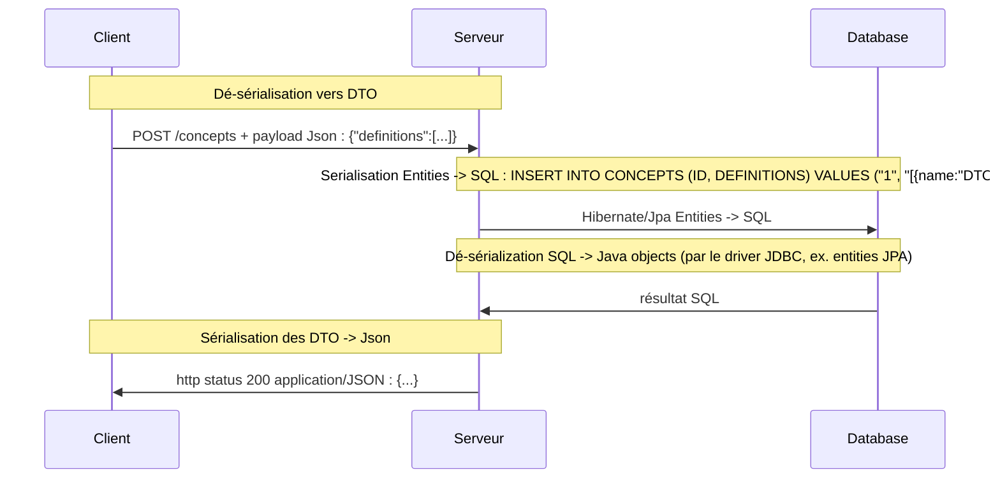
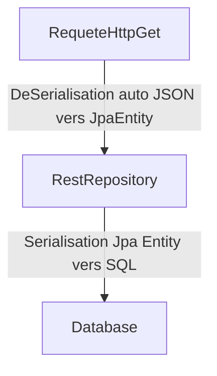
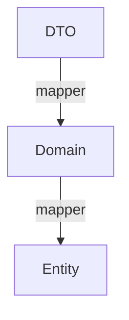

# Pourquoi les DTO et les Mappers?

Tu as travaillé sur une avec des DTO, mappers mais tu ne sais pas à quoi ça sert?
Prends une tasse de thé et accompagne moi.

## Définitions

### DTO

“Data Transfer Object”

Ce sont des
- "sacs de données" qui ne contiennent pas d'intelligence particulière.
- Continennent des données de types primitifs. (String, Integer, ...)
- Serialisables
- Très souvent ce sont des données "à plat". (il n'y a pas ou peu de grappes de données)

**Martin Fowler**

https://martinfowler.com/eaaCatalog/dataTransferObject.html

Utilités
- D'économiser des appels réseau (et du coup des données)
- permet de combiner des choses qui auraient été faites en plusieurs appels réseau
- Séparer la mécanique de (dé)sérialisation du reste de l'application (seuls les DTOs sont destinés à être sérialisés/déséralisés)
- Forme simplifiée de représentation de données métiers qui peuvent être complexes et difficiles à sérialiser

Inconvénients
- Ajoute des indirections et des Mappers

Ex.

```java
public class ConceptsDto implements Serializable{

	// N° de serialisation
	Date creation;
	List<DefinitionDto> definitions;
}

public class DefinitionDto implements Serializable{

	public String name;
	public String contenu;
	public Set<String> tags;
}
```


## Serializable, Serialisation/Désérialisation

Structure de données transformable sous forme de texte. Depuis ou vers du texte.

Ex.
- Depuis ou vers du Json
- Depuis ou vers du XML

En gros tu prends un fichier texte.

Forme sérialisée en Json
```json
{
	definitions:[
		{
			name: "DTO",
			contenu: "dsqdfqs"
		},
		{
		name: "Serializable"
		}
	]
}
```


Forme Désérialisée en Java

```java

public class ConceptsDeDtoEtMappers implements Serializable{

	// N° de serialisation
	List<Definition> definitions;
}

public class Definition implements Serializable{

	public String name;
}

```

Dans notre cas:
- Sérialiser = Transformer des objets Java en texte
- Dé-sérialiser = Transformer du texte en objet Java

Synonymes:
- Marshall / UnMarshall (XML) ex. avec Jaxb, CXF

Json : JaxRS, Jackson

Pourquoi sérialiser des objets?

C'est utile car format "neutre" pour communiquer avec différents systèmes.

On se met d'accord entre producteur et consommateur d'un format.
On n'a pas besoin de savoir comment ça fonctionne à l'intérieur du producteur ou du consommateur.

C'est un format intermédiaire.

On peut “se mettre d'accord”, établir un contrat d'interface (API) en utilisant des formats standards et des schémas.

- Avec des spécifications plus ou moins standardisées
    - SQL
    - XML (schémas : typer assez fortement les données)
    - JSON
    - CSV
    - ...
    
    
Ex. Désérialisation/Sérialisation lors d'un appel à une ressource REST d'une API s'appuyant sur une base de données SQL.



Création d'une nouvelle donnée




```java

class Exemple implements Serializable{

    // lors de la (dé)serialisation : il faut configurer l'outil pour utiliser une façon particulière (voir variantes ci-dessous)
	Date maDate;
	// LocalDateTime maDate;
}
```

En creusant plus loin, on peut sérialiser/désérialiser des types de plusieurs façons (tout en gardant les même types Java)
Inversement, on peut également utiliser des types différents qui continuent de sérialiser vers le même texte.

Ex. format de date en "timestamp"
https://www.timestamp.fr/?
```json
{
	maDate : 123143536547 // (timestamps)
}
```

Format de date

```json
{
  maDate : {
	  annee: "2022",
	  mois: "10",
	  jour: "30",
  }
}
```

Cela peut répondre à des problématiques d'intéropérabilité et de versionning d'API.

## Payload (ou body)

Données transportées dans le cadre d'une requete d'appel ou d'une réponse.

Ex. en HTTP.

https://synco-doc.timothedavid.fr/#/Auth/post_api_v1_auth_register


## CRUD

On dit d'une application qu'elle est un “simple CRUD” quand elle se contente de faire le lien entre son API et sa base de données sans trop d'intelligence supplémentaire.

Elle expose une API qui permettra d'effectuer les opérations suivantes:

- Create
- Read
- Update
- Delete

https://fr.wikipedia.org/wiki/CRUD

Ce type d'application est accesptable en soi et répond à une grande partie des besoins de beaucoup de logiciels.

Dans certains cas on utilise souvent directement des Entités JPA qu'on expose dans les Controllers REST.

Lorsque l'application grandit et se complexifie, cette architecture peut commencer à montrer ses limites.

Généralement on introduit des DTO et des services intermédiaire pour transformer un peu les données entre l'API et la base de données.
Cela permet d'éviter un couplage fort entre la base de données et l'API exposée.

Si un contrat change (API ou Base de données)
- Le fait d'avoir des DTO va éviter que le changement soit répercuté sur l'autre contrat.

## DAO : Data Access Object

Un objet qui permet de d'accéder à des données situées dans un système externe (très souvent une base de données).

https://fr.wikipedia.org/wiki/Objet_d%27acc%C3%A8s_aux_donn%C3%A9es

Voir aussi
https://martinfowler.com/eaaCatalog/transactionScript.html
https://martinfowler.com/articles/gateway-pattern.html

```java

public interface DefinitionDao {

	// Dans le cas d'un métier riche
	public Definitions findDefinitionWithTag(Tag tag)

	// Dans le cas d'un CRUD
	public DefinitionsDto findDefinitionWithTag(String tag)
	

}
```


## Domain Model

Dans des applications plutôt complexes.
On veut un peu plus que des données pures dans nos objets java.

En Programmation Orientée Objet (POO ou OOP), on aime bien grouper ensemble **des données** et **des algorithmes** (autrement dit du comportement).

**Martin Folwer**

https://martinfowler.com/eaaCatalog/domainModel.html

Dans notre exemple, on pourrait vouloir filtrer les définitions qui correspondent à un Tag.

Dans le "concept" de l'exemple : lister les définitions ayant pour tag "Java"

Concept
- date 30/10/2022 à 15h
- Définitions :
  - DTO : format de données à plat serialisable
    - tags : "DesignPattern", "Web", "Java"
  - Serialization : convertir du texte en classes et réciproquement
    - tags : "Java"
  - Payload : contenu joint à une requete ou une réponse réseau
    - tags: "HTTP"
      
Ici un domaine métier “riche”.
Le comportement de filtrage est une méthode de la classe Concept qui va elle même déléguer à des sous objets.

```java
class Concept {
	// données
	private final Date creation;
	private final Definitions definitions
	
	public Concept(Date creation, Definitions definitions){
		// 
	}

	// comportement
	public Definitions definitionsFor(Tag tag){
		// algo qui va filter
	}
}

class Definitions {
	private final List<Definition> values;

	public Definitons(List<Definition> values){
		//
	}
}

class Definition{
	private final String name;
	private final Contenu contenu;
	private final Tags tags;

	public Definition(String name, Contenu contenu, Tags tags){
		// 
	}
}

class Contenu{
	private final String value;

	public Contenu(String value){
	
	}
}

class Tags {
	private final Set<Tag> values;

	public Tags(Set<Tag> values){
		//
	}
}

class Tag {
	private final String value;

	public Tag(String value){
		//
	}
}

```


## Mapper


Convertir un objet dans une forme vers un objet dans une autre forme
Ex.
- Conversion de DTO vers Domain model et réciproquement.
- Conversion de Entity Jpa vers un Domain Model et réciproquement

### Cas d'une application CRUD

Pas besoin de mapper.

Directement on utilise les entités depuis la base de donées jusqu'aux Controlleurs REST. (Ex. [Spring Data REST](https://spring.io/projects/spring-data-rest))




Dans ton code, le repository JPA est en même temps un Controlleur REST.

Entre le moment ou on appele le controller REST et celui ou le Repository JPA appelle la base de données, il y pas ou peu de transformations.


**Ex.** Mon API et ma base de données n'est consommée que par mon application frontend et quand je change mon API je change mon frontend et ma base de données en même temps.

Si tu veux éviter que le changement de noms des attributs de ton Entity soit cassant avec l'extérieur tu peux utiliser des annotations pour configurer la sérialisation de ton Entity.

```java

import com.fasterxml.jackson.annotation.JsonProperty;

import javax.persistence.Column;
import javax.persistence.Entity;
import javax.persistence.Table;

// Ici, utiliser @Table(name="CXXX") et @Column(name="YYY")
// Permet de DECOUPLER le nom de l'attribut ou de la classe
// du nom de la table et des colonnes dans la base de données
// Si on change l'un, ça ne change pas l'autre
//
// @JsonProperty("name") permet de figer le nom de dans le 
// format JSON sérialisé
@Entity
@Table(name = "DEFINITION")
public class DefinitionEntity {

    @JsonProperty("name")
    @Column(name = "NAME")
    public String name;
    @Column(name = "CONTENU")
    public String contenu;
    //...
}

```


## CRUD avec un peu de logique entre le controlleur et la base de donnée

Plusieurs solutions dont
- Utiliser les Entity JPA dans le controlleur
- **Utiliser des DTO dans le controlleur pour éviter d'utiliser les Entity JPA**

### Entity dans les controllers

```java
package controller;

// Couplage TRES fort

// les noms des attributs de nos Entity correspondent aux noms des colonnes dans SQL
// les noms des attributs de nos Entity correspondent aux noms des attributs dans le JSON retourné
// - Changer un nom d'attribut d'Entity => Changement de SQL ET un changement de Swagger

// Risque de sécurité (on dévoile indirectement la structure de la base de données)
// Quand les Entity changent, ca change automatiquement les Controllers (et swagger)
//   - Problème de contrat d'interface avec l'extérieur
//   - Risque de changement cassant des consommateurs de l'API si le contrat change
//
public class EntityConceptController {

    private final ConceptRepository conceptRepository;

    // @Autowired
    public EntityConceptController(ConceptRepository conceptRepository) {
        this.conceptRepository = conceptRepository;
    }

    public List<ConceptEntity> all() {
        return conceptRepository.findAll();
    }

    public List<DefinitionEntity> findDefinitionsByTag(String tag) {
        List<DefinitionEntity> definitons = conceptRepository.findAllDefinitionsByTag(tag);


        for (DefinitionEntity definiton : definitons) {
            definiton.tags=null;
            definiton.contenu=null;
        }

        return definitons;
        // risque de modifier les données de la base de données selon la configuration de JPA
    }
}

```


### Séparer Dto de Entity


Solution : utiliser des DTO pour "absorber" ce couplage

https://github.com/marc-bouvier/kata-dto-domain-model-java/blob/master/java/junit5/src/main/java/controller/EntityDtoConceptController.java

```java
package controller;


import dao.ConceptRepository;
import dto.ConceptResponseDto;
import dto.DefinitionsByTagResponseDto;

import java.util.List;


// Couplage MOINBS fort

// les noms des attributs de nos Entity correspondent aux noms des colonnes dans SQL
// les noms des attributs de nos DTO correspondent aux noms des attributs dans le JSON retourné
// - Changer un nom d'attribut d'Entity => Changement de SQL MAIS PAS un changement de Swagger
// - Changer un nom d'attribut dans DOT => Changement de Swagger MAIS PAS de SQL

// Sécurité on ne dévoile plus la structure de la base de données
// - on peut choisir de n'exposer que le stricit minimum côté API

public class EntityDtoConceptController {

    private final ConceptRepository conceptRepository;

    // @Autowired
    public EntityDtoConceptController(ConceptRepository conceptRepository) {
        this.conceptRepository = conceptRepository;
    }

    public List<ConceptResponseDto> all() {
        return ConceptResponseDto
                .fromList(conceptRepository.findAll());
    }

    public DefinitionsByTagResponseDto findDefinitionsByTag(String tag) {
        return DefinitionsByTagResponseDto
                .fromList(conceptRepository.findAllDefinitionsByTag(tag));
    }
}

```

Inconvénients
- C'est plus compliqué
- Nécessite des mappers

Avantages:
- Quand un changement a lieu côté API ou Entity cas casse les mappers (et pas le reste du code)


## Séparer DTO, Domain Model, Entities

Ici, on introduit des Domain Model entre les DTO de l'API et les Entity (qui sont en fait des DTO mais côté base de données).

Cela permet d'effectuer des opérations complexes sans devoir dépendre de la structure de données que nous impose la base de données ou l'API.
Cela rendre par ailleurs testable la logique métier sans forcément lancer le serveur d'API ou une base de données.



Ici, les mappers servent d'amortisseur.

C'est à dire que:
- Si un truc change à un endroit c'est le mapper qui casse.
  - Le Domain Model est protégé des changements de la base de données ET des changements de l'API

Donc, les DTO et les mappers permettent un couplage plus faible entre l'API, le Domain Model et la base de données.

## Couplage

- **Couplage fort** : quand on change un truc quelque part, ca change des trucs à plusieurs autres endroits
- **Couplage faible** : quand on change un truc quelque part, ca change peu/pas d'autres trucs

## Conclusion

Essayer d'avoir un couplage faible entre les modules avec lesquels intéragissent ton système.

- **Protège** les utilisateurs de ton API de changements qui viennent de ton Domain Model ou de ta base de données
- **Réduit la surface d'attaque** de ton application en t'évitant d'exposer les détails des structures de données de ta base de données
- **Rend plus facilement testable** ta logique métier
- **Introduit plus de complexité** du fait d'indirections supplémentaires (DTOs et mappers)

**A.** Si ton application est simple et que tu est le seul consommateur de ton API et de ta base de données
- CRUD est certainement ce que tu cherches

**B.** Si ton application reste simple
- avec d'autres consommateurs de ton API ou de ta base de données

Tu peux pour le moment te contenter de jouer sur la configuration des Serialisers/Deserializers (annotations Jackson `@JsonProperty("name")`, annotations JPA `@Table(name="TABLENAME")`, `@Column(name="COLNAME")`...).
Ou utiliser des DTO et Mappers.

**C.** Si ton application est complexe OU simple mais va devenir plus complexe.

Il peut être intéressant d'introduire des DTO/Mappers voire également des Domain Model.
