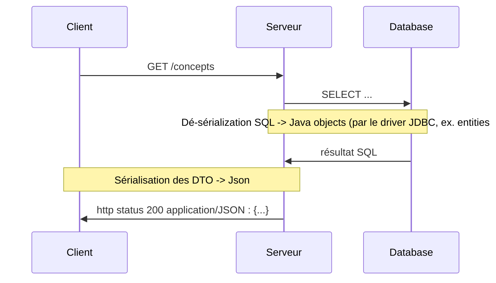
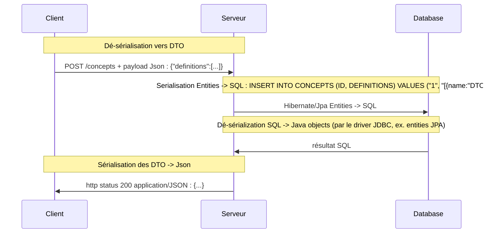
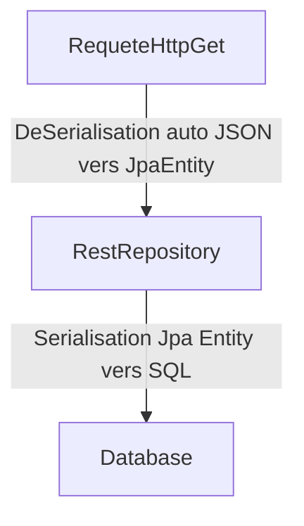
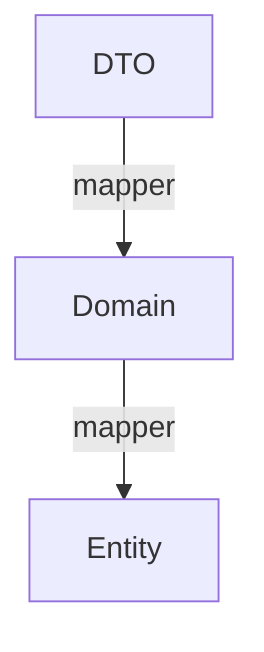

# Concept de DTO et mappers

Tu as travaillé sur une avec des DTO, mappers.

## Définitions

### DTO

Data Transfer Object

Ce sont des
- "sacs de données" qui ne contiennent pas d'intelligence particulière.
- Continennent des données de types primitifs. (String, Integer, ...)
- Serialisables
- Très souvent ce sont des données "à plat". (il n'y a pas ou peu de grappes de données)


**Martin Fowler**

https://martinfowler.com/eaaCatalog/dataTransferObject.html

Utilités
- D'économiser des appels réseau (et du coup des données)
- permet de combiner des choses qui auraient été faites en plusieurs appels réseau
- Séparer la mécanique de (dé)sérialisation du reste de l'application (seuls les DTOs sont destinés à être sérialisés/déséralisés)
- Forme simplifiée de représentation de données métiers qui peuvent être complexes et difficiles à sérialiser


```java
public class ConceptsDto implements Serializable{

	// N° de serialisation
	Date creation;
	List<DefinitionDto> definitions;
}

public class DefinitionDto implements Serializable{

	public String name;
	public String contenu;
	public Set<String> tags;
}
```


## Serializable

Transformable sous forme de texte. Depuis ou vers du texte.


Depuis ou vers du Json
Depuis ou vers du XML

En gros tu prends un fichier texte.

Forme sérialisée en Json
```json
{
	definitions:[
		{
			name: "DTO",
			contenu: "dsqdfqs"
		},
		{
		name: "Serializable"
		}
	]
}
```


Forme Désérialisée en Java

```java

public class ConceptsDeDtoEtMappers implements Serializable{

	// N° de serialisation
	List<Definition> definitions;
}

public class Definition implements Serializable{

	public String name;
}

```


Sérialiser = Transformer des objets java en texte
Dé-sérialiser = Transformer du texte en objet java

Marshall / UnMarshall (XML) ex. avec Jaxb CXF
Json : JaxRS, Jackson

Utile car format "neutre" pour communiquer avec différents systèmes.
- Avec des spécifications plus ou moins standardisées
    - SQL
    - XML (schémas : typer assez fortement les données)
    - JSON



Création d'une nouvelle donnée




```java

class Exemple implements Serializable{

    // lors de la (dé)serialisation : il faut configurer l'outil pour utiliser une façon particulière (voir variantes ci-dessous)
	Date maDate;
	// LocalDateTime maDate;
}
```

Ex. format de date en "timestamp"
https://www.timestamp.fr/?
```json
{
	maDate : 123143536547 // (timestamps)
}
```

Format de date

```json
{
  maDate : {
	  annee: "2022",
	  mois: "10",
	  jour: "30",
  }
}
```

## Payload (ou body)

Données transportées dans le cadre d'une requete d'appel ou d'une réponse.

Ex. en HTTP.

https://synco-doc.timothedavid.fr/#/Auth/post_api_v1_auth_register


## Domain Model

Dans des applications plutôt complexes.
On veut un peu plus que des données pures dans nos classes java.

En Programmation Orientée Objet (POO ou OOP), on aime bien grouper ensemble **des données** et **des algorithmes** (autrement dit du comportement).

**Martin Folwer**

https://martinfowler.com/eaaCatalog/domainModel.html

Dans notre exemple, on pourrait vouloir filtrer les définitions qui correspondent à un Tag.


Dans le "concept" de l'exemple : lister les définitions ayant pour tag "Java"

Concept
- date 30/10/2022 à 15h
- Définitions : 
    - DTO : format de données à plat serialisable
      - tags : "DesignPattern", "Web", "Java"
    - Serialization : convertir du texte en classes et réciproquement
      - tags : "Java"
    - Payload : contenu joint à une requete ou une réponse réseau
      - tags: "HTTP"

```java
class Concept {
	// données
	private final Date creation;
	private final Definitions definitions
	
	public Concept(Date creation, Definitions definitions){
		// 
	}

	// comportement
	public Definitions definitionsFor(Tag tag){
		// algo qui va filter
	}
}

class Definitions {
	private final List<Definition> values;

	public Definitons(List<Definition> values){
		//
	}
}

class Definition{
	private final String name;
	private final Contenu contenu;
	private final Tags tags;

	public Definition(String name, Contenu contenu, Tags tags){
		// 
	}
}

class Contenu{
	private final String value;

	public Contenu(String value){
	
	}
}

class Tags {
	private final Set<Tag> values;

	public Tags(Set<Tag> values){
		//
	}
}

class Tag {
	private final String value;

	public Tag(String value){
		//
	}
}

```
## CRUD

- Create
- Read
- Update
- Delete

Très peu de logique (d'intelligence métier).

Dans ce cas on utilise souvent uniquement des DTO qu'on manipule dans des petites classes de service.


## DAO : Data Access Object

Un objet qui permet de d'accéder à des données situées dans un système externe (très souvent une base de données).

https://martinfowler.com/eaaCatalog/transactionScript.html
https://martinfowler.com/articles/gateway-pattern.html

```java

public interface DefinitionDao {

	// Dans le cas d'un métier riche
	public Definitions findDefinitionWithTag(Tag tag)

	// Dans le cas d'un CRUD
	public DefinitionsDto findDefinitionWithTag(String tag)
	

}
```


## Mapper

Conversion de DTO vers Domain model et réciproquement.
Convertir un objet dans une forme vers un objet dans une autre forme


### CRUD le plus pur

Pas besoin de mapper.

Directement on utilise les entités depuis la base de donées jusqu'aux Controlleurs REST. (Ex. [Spring Data REST](https://spring.io/projects/spring-data-rest))




Dans ton code, le repositort JPA est en même temps un Controlleur REST.

Entre le moment ou on appele le controller REST et celui ou le Repository JPA appelle la base de données, il y  pas ou peu de transformations.


**Ex.** Mon API et ma base de données n'est consommée que par mon application frontend et quand je change mon API je change mon frontend et ma base de données en même temps.


## CRUD avec un peu de logique entre le controlleur et la base de donnée


2 solutions
- Utiliser les Entity JPA dans le controlleur
- **Utiliser des DTO dans le controlleur pour éviter d'utiliser les Entity JPA**

### Entity dans les controllers
```java
// Couplage TRES fort

// les noms des attributs de nos Entity correspondent aux noms des colonnes dans SQL
// les noms des attributs de nos Entity correspondent aux noms des attributs dans le JSON retourné
// - Changer un nom d'attribut d'Entity => Changement de SQL ET un changement de Swagger


// Risque de sécurité (on dévoile indirectement la structure de la base de données)
// Quand les Entity changent, ca change automatiquement les Controllers (et swagger)
//   - Problème de contrat d'interface avec l'extérieur
//   - Risque de changement cassant des consommateurs de l'API si le contrat change
// 
public class ConceptController{
	public List<ConceptEntity> all(){
		return conceptRepository.findAll();
	}

	public List<DefinitionEntity> findDefinitionsByTag(String tag){
		List<ConceptEntity> concepts =  conceptRepository.findAllByTag(tag);
		
		List<DefinitionEntity> definitions = concepts.stream().flatMap(...)
		
		List<DefinitionEntity> lightDefinitions = definitions.stream()
		  .map(/* met null partout sauf name */);

		// risque de modifier les données de la base de données selon la configuration de JPA

		return lightDefinitions;
	}
}

```


### Séparer Dto de Entity


Solution : utiliser des DTO pour "absorber" ce couplage

https://github.com/marc-bouvier/kata-dto-domain-model-java/blob/master/java/junit5/src/main/java/controller/EntityDtoConceptController.java

```java
package controller;  
  
// Couplage moins fort  
  
// les noms des attributs de nos Entity correspondent aux noms des colonnes dans SQL  
// les noms des attributs de nos DTO correspondent aux noms des attributs dans le JSON retourné  
// - Changer un nom d'attribut d'Entity => Changement de SQL MAIS PAS Swagger
  
  
import dao.ConceptRepository;  
import dto.ConceptResponseDto;  
import dto.DefinitionsByTagResponseDto;  
  
import java.util.List;  
  
  
// Risque de sécurité (on dévoile indirectement la structure de la base de données)  
// Quand les Entity changent, ca change automatiquement les Controllers (et swagger)  
//   - Problème de contrat d'interface avec l'extérieur  
//   - Risque de changement cassant des consommateurs de l'API si le contrat change  
//  
public class EntityDtoConceptController {  
  
    private final ConceptRepository conceptRepository;  
  
    // @Autowired  
    public EntityDtoConceptController(ConceptRepository conceptRepository) {  
        this.conceptRepository = conceptRepository;  
    }  
  
    public List<ConceptResponseDto> all() {  
        return ConceptResponseDto  
                .fromList(conceptRepository.findAll());  
    }  
  
    public DefinitionsByTagResponseDto findDefinitionsByTag(String tag) {  
        return DefinitionsByTagResponseDto  
                .fromList(conceptRepository.findAllDefinitionsByTag(tag));  
    }  
}

```

Iconvénients
- C'est plus compliqué


## Séparer DTO, Domain Model , Entities




Ici, les mappers servent d'amortisseur.
C'est à dire que
- Si un truc change à un endroit c'est le mapper qui casse.


## Couplage

- **Couplage fort** : quand on change un truc quelque part, ca change des trucs à plusieurs autres endroits
- **Couplage faible** : quand on chang un truc quelque part, ca change peu/pas d'autres trucs

